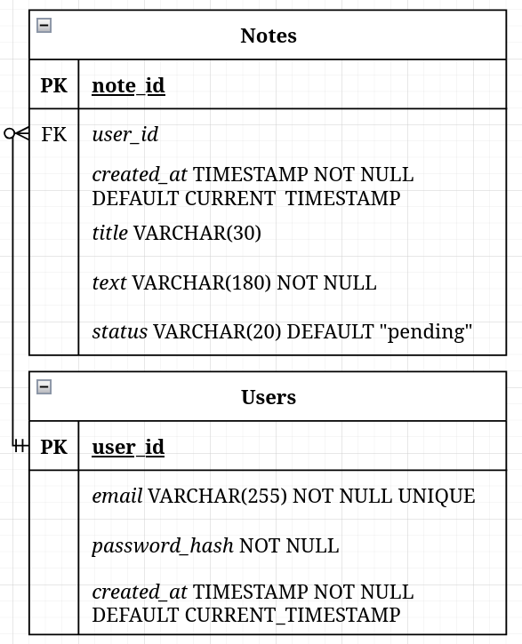

# Database Design


## Overview

The system uses a relational database (PostgreSQL) to store users and their notes.

The schema follows a simple one-to-many relationship:

- One user can have zero to many notes.
- Each note must belong to exactly one user.



---

## Entity Relationship Overview

Users (1) ──── (N) Notes

---

## Tables

### 1. users

Represents authenticated accounts.

```sql
CREATE TABLE users (
    user_id UUID PRIMARY KEY,
    email VARCHAR(255) NOT NULL UNIQUE,
    password_hash TEXT NOT NULL,
    created_at TIMESTAMP NOT NULL DEFAULT CURRENT_TIMESTAMP
);
```

#### Fields

| Column         | Type           | Constraints                | Description |
|---------------|---------------|----------------------------|------------|
| user_id       | UUID          | PRIMARY KEY                | Unique identifier for user |
| email         | VARCHAR(255)  | NOT NULL, UNIQUE           | User email address |
| password_hash | TEXT          | NOT NULL                   | Securely hashed password |
| created_at    | TIMESTAMP     | NOT NULL, DEFAULT now()    | Account creation timestamp |

---

### 2. notes

Represents individual notes created by users.

```sql
CREATE TABLE notes (
    note_id UUID PRIMARY KEY,
    user_id UUID NOT NULL,
    title VARCHAR(255),
    text TEXT NOT NULL,
    status VARCHAR(20) NOT NULL,
    created_at TIMESTAMP NOT NULL DEFAULT CURRENT_TIMESTAMP,
    CONSTRAINT fk_user
        FOREIGN KEY (user_id)
        REFERENCES users(user_id)
        ON DELETE CASCADE,
    CONSTRAINT status_check
        CHECK (status IN ('pending', 'promoted', 'expired'))
);
```

#### Fields

| Column     | Type          | Constraints                          | Description |
|------------|--------------|--------------------------------------|------------|
| note_id    | UUID         | PRIMARY KEY                          | Unique identifier for note |
| user_id    | UUID         | NOT NULL, FOREIGN KEY                | Owner reference |
| title      | VARCHAR(255) | Optional                             | Optional note title |
| text       | TEXT         | NOT NULL                             | Note content |
| status     | VARCHAR(20)  | NOT NULL, CHECK constraint           | Lifecycle state |
| created_at | TIMESTAMP    | NOT NULL, DEFAULT now()              | Creation timestamp |

---

## Relationships

- `notes.user_id` references `users.user_id`
- One user → many notes
- Each note → exactly one user
- Deleting a user cascades deletion of their notes

---

## Indexing Strategy

Recommended indexes:

```sql
CREATE INDEX idx_notes_user_id ON notes(user_id);
CREATE INDEX idx_notes_created_at ON notes(created_at);
```

These support:

- Fetching notes per user
- Sorting or filtering by creation date

---

## Normalization

- 1NF: All fields atomic
- 2NF: No partial dependencies
- 3NF: No transitive dependencies

The schema is fully normalized for MVP scope.

---

## Future Extensions (Optional)

- Tagging table (`tags`, `note_tags`)
- Soft deletion (`deleted_at`)
- Encrypted content column
- Full-text search index